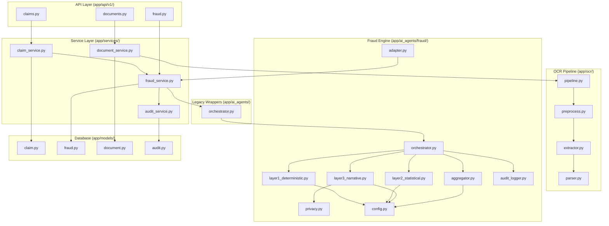
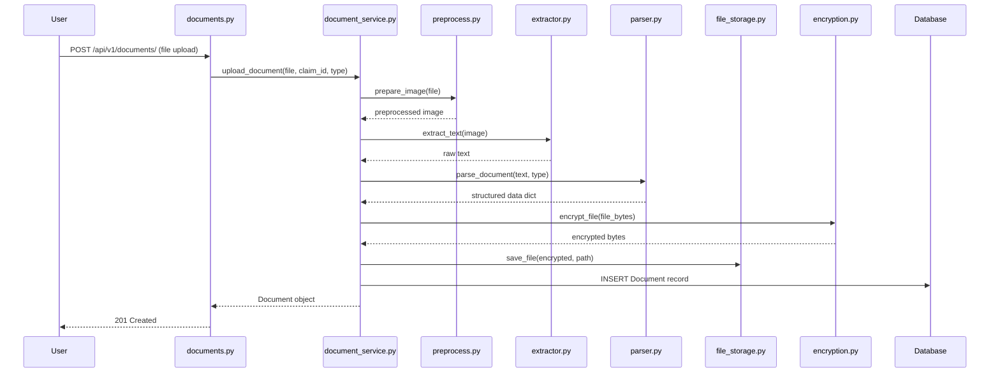
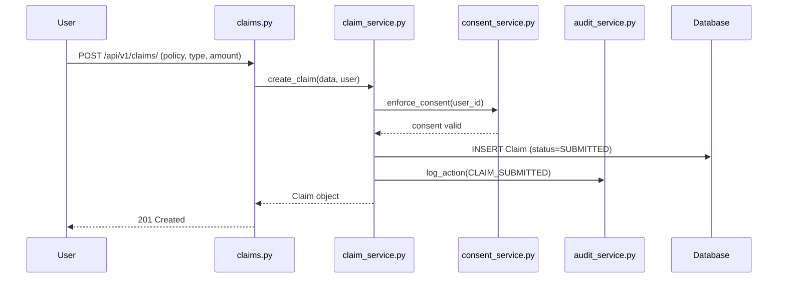
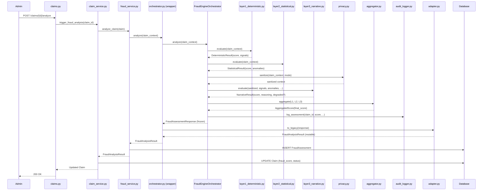
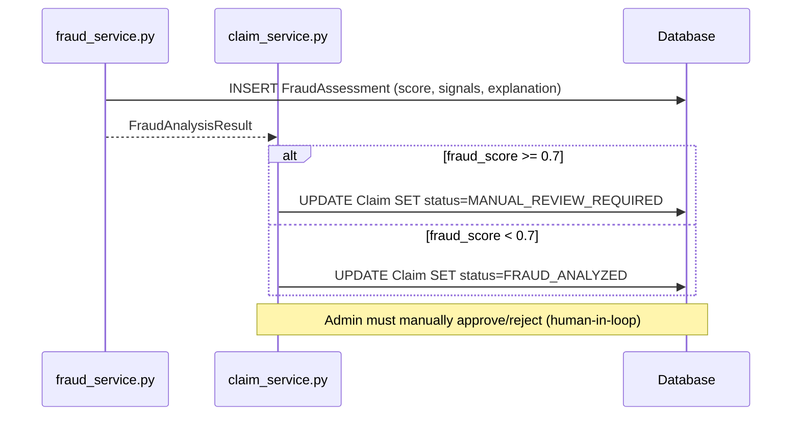
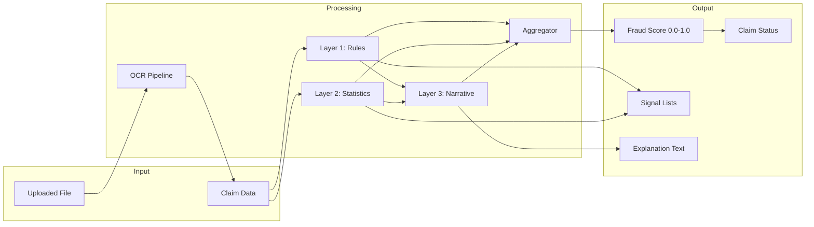

# InsureFlow-AI -- Complete System Flow Reference

This document traces every file in the pipeline from document upload through fraud detection and storage. Use this to understand what to modify when adding or changing features.

---

## 1. High-Level Architecture

---

## 2. Complete Execution Flow

### Phase 1: Document Upload and OCR

#### File-by-file breakdown:

**`app/api/v1/documents.py`** -- Entry point
- Receives multipart file upload
- Validates file type (PDF, JPEG, PNG) and size (max 10MB)
- Calls `DocumentService.upload_document()`
- To modify: add file type restrictions, virus scanning

**`app/ocr/pipeline.py`** -- OCR coordinator
- Calls preprocessing, extraction, and parsing in sequence
- Returns `(raw_text, structured_data_dict)`
- To modify: add new pipeline steps, change processing order

**`app/ocr/preprocess.py`** -- Image enhancement
- Grayscale conversion, denoising, adaptive thresholding, deskew
- To modify: add rotation correction, contrast enhancement

**`app/ocr/extractor.py`** -- Tesseract OCR
- Runs OCR on preprocessed image, returns raw text
- To modify: change language, PSM mode, confidence filtering

**`app/ocr/parser.py`** -- Structured data extraction
- Regex patterns per document type (INVOICE, PRESCRIPTION, MEDICAL_REPORT)
- Extracts: amount, date, provider name, invoice number, medications
- To modify: add new document types, improve regex, add NLP

**`app/utils/file_storage.py`** -- Encrypted storage
- Generates UUID filename, encrypts via Fernet, saves to disk
- To modify: switch to S3/Azure Blob, add compression

**`app/utils/encryption.py`** -- Fernet encryption
- Uses `ENCRYPTION_KEY` from `.env`
- To modify: add key rotation, switch algorithm

---

### Phase 2: Claim Submission

**`app/api/v1/claims.py`** -- Claim endpoints
- POST create, GET list, GET by ID, PUT status, POST analyze
- To modify: add claim templates, multi-step submission

**`app/services/claim_service.py`** -- Claim lifecycle
- `create_claim()`: validates consent, creates record, audits. Does NOT auto-trigger fraud analysis
- `trigger_fraud_analysis()`: called by admin via `POST /claims/{id}/analyze`
- To modify: add auto-analysis on creation, add validation rules

**`app/services/consent_service.py`** -- DPDP Act consent
- Enforces user has given consent before claim creation
- To modify: change consent version or requirements

---

### Phase 3: Fraud Detection

#### File-by-file breakdown:

**`app/services/fraud_service.py`** -- Fraud analysis coordinator
- Builds `claim_context` dict from Claim model
- Calls `FraudOrchestrator.analyze(claim_context)`
- Stores `FraudAssessment` in DB
- Logs to audit trail
- **GAP**: Does not currently pass `recent_claim_count`, `prior_fraud_flags`, `days_to_policy_expiry` (see gap_analysis.md)
- To modify: add historical data queries, add caching

**`app/ai_agents/orchestrator.py`** -- Legacy wrapper
- Thin wrapper preserving `FraudOrchestrator` class name
- Delegates to `FraudEngineOrchestrator.analyze()`
- Converts output via `adapter.to_legacy()`
- To modify: this is just glue -- modify the engine files below instead

**`app/ai_agents/fraud/orchestrator.py`** -- Engine coordinator
- Runs Layer 1 -> Layer 2 -> Layer 3 -> Aggregator -> Audit
- Builds explanation text from structured reasoning
- Returns frozen `FraudAssessmentResponse`
- To modify: change layer execution order, add new layers

**`app/ai_agents/fraud/config.py`** -- Central configuration
- All thresholds, weights, baselines, versioning
- To modify: change any fraud detection parameter here, then bump `CONFIG_VERSION`

| Parameter | Current Value | What it controls |
|-----------|---------------|------------------|
| `WEIGHT_DETERMINISTIC` | 0.40 | Layer 1 weight in final score |
| `WEIGHT_STATISTICAL` | 0.35 | Layer 2 weight in final score |
| `WEIGHT_NARRATIVE` | 0.25 | Layer 3 weight in final score |
| `CLAIM_AMOUNT_THRESHOLDS` | HEALTH:500K, MOTOR:200K, REIMB:300K | L1 amount triggers |
| `Z_SCORE_THRESHOLD` | 2.5 | L2 outlier sensitivity |
| `HIGH_CLAIM_FREQUENCY_THRESHOLD` | 3 | L2 frequency trigger |
| `RISK_LEVEL_BOUNDARIES` | VERY_HIGH:0.85, HIGH:0.70, ... | Risk label mapping |
| `ENABLE_EXTERNAL_AI` | False | AI mode (local-only default) |

**`app/ai_agents/fraud/layer1_deterministic.py`** -- Rule engine
- Checks: amount thresholds, round amounts, policy format
- Scoring: each signal = 0.15, capped at 1.0
- To modify: add new rules (duplicate invoice, time-of-day)

**`app/ai_agents/fraud/layer2_statistical.py`** -- Anomaly detector
- Z-score on claim amount vs type baseline
- Behavioral: claim frequency, prior fraud flags, near-expiry
- To modify: add provider risk, temporal clustering, ML model

**`app/ai_agents/fraud/layer3_narrative.py`** -- Explanation generator
- Privacy-gates input through `privacy.py` before processing
- Local-only by default; external AI opt-in with timeout fallback
- Builds structured reasoning dict with risk level, signal explanations, recommendation
- To modify: add external AI integration, improve templates

**`app/ai_agents/fraud/privacy.py`** -- PII sanitizer
- `strict`: removes all PII, replaces amounts with bands
- `balanced` (default): masks partial PII, keeps amounts
- `raw`: no sanitization (explicit opt-in only)
- To modify: add new PII patterns, change masking rules

**`app/ai_agents/fraud/aggregator.py`** -- Score combiner
- Normal: weighted average (0.40 / 0.35 / 0.25)
- Degraded (AI fails): renormalized (0.55 / 0.45 / 0.00)
- Clamps final score to [0.0, 1.0]
- To modify: change weights in config.py, add non-linear scoring

**`app/ai_agents/fraud/audit_logger.py`** -- Fraud audit log
- Writes to dedicated audit logger (never logs raw PII)
- Records: claim_id, score, privacy_mode, config_version, timestamp
- To modify: add fields, change log format

**`app/ai_agents/fraud/adapter.py`** -- Schema converter
- Converts frozen engine response to mutable legacy `FraudAnalysisResult`
- Maps field names for backward compatibility
- To modify: only if you change schemas

**`app/schemas/fraud.py`** -- All fraud-related type contracts
- Engine layer results: `DeterministicResult`, `StatisticalResult`, `NarrativeResult` -- per-layer output
- `AggregatedScore` -- combiner output
- `FraudEngineResponse` -- final frozen engine output with config version
- `FraudAnalysisResult` -- mutable legacy result for service layer
- `FraudAssessmentResponse` -- API response schema (reads from DB)
- All scores clamped to [0.0, 1.0] via validators
- To modify: add new fields to layer outputs

---

### Phase 4: Storage and Status Update

**`app/models/fraud.py`** -- FraudAssessment DB model
- Stores: fraud_score, deterministic_signals_json, statistical_signals_json, explanation_text
- Linked to Claim via foreign key
- To modify: add behavioral_flags column, add config_version column

**`app/models/claim.py`** -- Claim DB model
- Status workflow: SUBMITTED -> FRAUD_ANALYZED or MANUAL_REVIEW_REQUIRED -> APPROVED/REJECTED -> SETTLED
- Stores fraud_score on the claim itself
- To modify: add new status values, add new fields

---

## 3. Data Flow Diagram

---

## 4. Quick Reference: Where to Make Changes

| I want to... | File(s) to modify |
|--------------|-------------------|
| Add a new fraud rule | `fraud/layer1_deterministic.py` + `fraud/config.py` |
| Add a new anomaly check | `fraud/layer2_statistical.py` + `fraud/config.py` |
| Change fraud score weights | `fraud/config.py` (WEIGHT_* variables) |
| Add external AI integration | `fraud/layer3_narrative.py` (_call_external_ai) + `fraud/config.py` |
| Change PII sanitization | `fraud/privacy.py` |
| Add new document type for OCR | `ocr/parser.py` + `core/constants.py` |
| Change file encryption | `utils/encryption.py` |
| Add new API endpoint | `api/v1/<module>.py` + `api/router.py` |
| Add new claim validation | `services/claim_service.py` |
| Change fraud threshold | `config.py` (FRAUD_THRESHOLD) + `fraud/config.py` (RISK_LEVEL_BOUNDARIES) |
| Add historical data for Layer 2 | `services/fraud_service.py` (add to claim_context dict) |
| Add new DB field to fraud assessment | `models/fraud.py` + `services/fraud_service.py` |
| Store behavioral flags in DB | `models/fraud.py` (add column) + `services/fraud_service.py` |

---

## 5. Known Gaps

See [gap_analysis.md](gap_analysis.md) for a detailed list of 9 identified code gaps and 3 warnings, including severity ratings and fix instructions.
